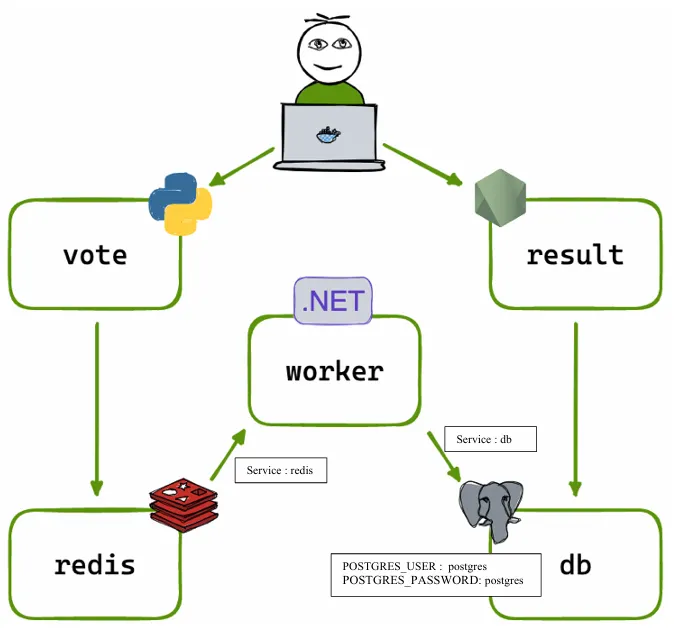

# Voting app avec Kubernetes

**Mise en place d'une application distribuée composée de plusieurs microservices (frontend, backend, base de données, cache) conteneurisés et orchestrés par Kubernetes.**

## Architecture



* **Vote App (Python)** : application web permettant aux utilisateurs de voter entre deux options (cat/dogs)
* **Redis** : cache qui mémorise les nouveaux votes
* **Worker (.NET)** : consomme les votes depuis Redis et les stocke dans une **base de données PostgreSQL** soutenue par un volume Docker
* **Result App (Node.js)** : application web qui affiche les résultats du vote en temps réel

## Application fonctionnelle sans Ingress

### Les différentes commandes à suivre
```
# Déploiement des microservices
kubectl apply -f db.yaml
kubectl apply -f redis.yaml
kubectl apply -f vote.yaml
kubectl apply -f worker.yaml
kubectl apply -f result.yaml

# Vérifier que tous les pods nécessaires sont en cours d'exécution
kubectl get pods

# Vérifier que les services sont exposés sur les ports adéquats
kubectl get svc
```
Suivant le résultat de `kubectl get svc`, vous devriez pouvoir accéder aux applications suivantes depuis les ports exposés sur votre machine locale (nodePort définis dans **vote.yml** et **result.yml**) :

* Vote App : [http://localhost:31000](http://localhost:31000)
* Result App : [http://localhost:31001](http://localhost:31001)

### Procédure à suivre en cas de problèmes

Dans le cas où vous n'arriveriez pas à accéder à vos applications, veuillez suivre ces instructions :

1. Exécutez `kubectl get endpoints` et assurez-vous que chaque service possède bien un ENDPOINT.
Si l'un des services affiche `<none>` en tant qu'ENDPOINT, passez à l'étape suivante.
2. Exécutez `kubectl get pods` et vérifiez que vous ne possédez pas plusieurs pods pour un même service. 
Si c'est le cas, il peut s'agir d'un problème de replicas.
Vous devrez alors exécuter les commandes suivantes :

```
# Supprimer le déploiement problématique
kubectl delete deployment <nom-deployment>

# Réappliquer le déploiement
kubectl apply -f <fichier.yml>

# Vérifier que le service récupère bien un ENDPOINT
kubectl get endpoints <nom-service>
```

## Application fonctionnelle avec Ingress

L'utilisation d'un Ingress va permettre d'exposer nos services à l'extérieur du cluster.<p></p>

Nous utiliserons **Ingress Nginx Controller** qui agira comme point d'entrée unique et permettra :
* Le routage HTTP/S vers les services en fonction des règles spécifiées dans l'Ingress
* Le load balancing entre les pods afin d'assurer la disponibilité et la scalabilité.

### Les différentes commandes à suivre

```
# Déployer l’Ingress Nginx Controller dans le cluster
kubectl apply -f https://raw.githubusercontent.com/kubernetes/ingress-nginx/controller-v1.12.0-beta.0/deploy/static/provider/cloud/deploy.yaml

# Vérifier que le déploiement est fonctionnel en vérifiant les pods
kubectl get pods -n ingress-nginx

# Déploiement des nouveaux services
kubectl apply -f vote-lb.yml
kubectl apply -f result-lb.yml
kubectl apply -f ingress.yml

# Vérifier que l'Ingress est bien défini
kubectl get ingress
```

Modifiez votre fichier hosts afin de rediriger les noms de domaine vers votre IP localhost pour effectuer un test local :
* Sur MAC/Linux : **etc/hosts**
* Sur Windows : **C:\Windows\System32\drivers\etc\hosts**

<p></p>

Ajoutez les lignes suivantes à la fin du fichier (nécessite des droits administrateur) :

```
127.0.0.1 vote.votingapp.com 
127.0.0.1 result.votingapp.com 
```

Vérifiez la résolution des noms de domaine en exécutant les commandes `ping vote.votingapp.com` et `ping result.votingapp.com` dans un terminal, vous devriez obtenir une réponse provenant de 127.0.0.1

Une fois la redirection confirmée, accédez aux applications via votre navigateur :
* Vote App : [http://vote.votingapp.com](http://vote.votingapp.com)
* Result App : [http://result.votingapp.com](http://result.votingapp.com)

### Afficher les logs des services

Afin de diagnostiquer et d'obtenir plus d'informations sur le fonctionnement des services, exécutez la commande suivante : `kubectl logs deployment/<nom-service>`
